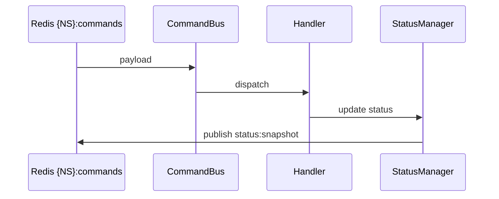

# Runtime — розширена документація

## Призначення каталогу
Каталог runtime містить виконувані компоненти пайплайна: командну шину, статус/метрики, warmup/backfill, rebuild HTF, republish, tail guard, HTTP API, симулятори та публікацію в Redis (app/main.py#L40-L358).

## Швидка карта відповідальностей
- **Commands (Redis)** → CommandBus → handlers → status/snapshot (runtime/command_bus.py#L12-L170; runtime/status.py#L32-L144).
- **Final data** → SQLite (store/schema.sql#L1-L70) → HTTP /api/ohlcv?mode=final (runtime/http_server.py#L93-L129).
- **Preview data** → OhlcvCache/PreviewBuilder → HTTP /api/ohlcv?mode=preview (runtime/preview_builder.py#L39-L124; runtime/http_server.py#L93-L129).

## Lifecycle (запуск → робота → зупинка)
1) Ініціалізація конфігу, валідатора, SQLite, Redis, метрик, календаря, status snapshot (app/main.py#L40-L100).
2) Підйом HTTP сервера /chart і API (app/main.py#L102-L118; runtime/http_server.py#L49-L140).
3) Запуск CommandBus та основного циклу poll/tick/preview (app/main.py#L252-L358).
4) Зупинка: перехоплення KeyboardInterrupt, stop HTTP сервера (app/main.py#L354-L363; runtime/http_server.py#L49-L62).

## Конфіг та публічна поверхня
- Namespace, Redis, порти, preview/tick симулятори — SSOT у конфігу (config/config.py#L1-L79).
- Redis public surface:
  - {NS}:commands (config/config.py#L60-L67)
  - {NS}:price_tik (config/config.py#L69-L70)
  - {NS}:ohlcv (config/config.py#L72-L73)
  - {NS}:status (config/config.py#L58-L63)
  - {NS}:status:snapshot (config/config.py#L75-L77)

## Команди та їх обробники
Handlers визначені у composition root (app/main.py#L252-L265):
- **fxcm_warmup** → `_handle_warmup` (app/main.py#L140-L208).
- **fxcm_backfill** → `_handle_backfill` (app/main.py#L210-L244).
- **fxcm_tail_guard** → `_handle_tail_guard` (app/main.py#L214-L248; runtime/tail_guard.py#L34-L140).
- **fxcm_republish_tail** → `_handle_republish_tail` (app/main.py#L226-L251; runtime/republish.py#L15-L129).

Команди валідовані через JSON Schema (runtime/command_bus.py#L82-L110; core/contracts/public/commands_v1.json#L1-L14).

## HTTP API (read-only)
Реалізація у runtime/http_server.py:
- **/api/status** → читає {NS}:status:snapshot (runtime/http_server.py#L63-L86).
- **/api/ohlcv** →
  - mode=final: SQLite, 1m або HTF (runtime/http_server.py#L93-L129).
  - mode=preview: in-memory cache (runtime/http_server.py#L124-L129).
- **/chart** → статичний HTML (runtime/http_server.py#L131-L140).

Порти керуються конфігом: metrics_port і http_port (config/config.py#L18-L52; app/main.py#L53-L79).

## Статус і метрики
Status snapshot включає: process/market/errors/degraded/price/ohlcv/derived/tail_guard/republish (runtime/status.py#L32-L144).
- **errors[]** — loud помилки (runtime/command_bus.py#L86-L159).
- **degraded** — зокрема `calendar_error` при ініціалізаційній помилці календаря (runtime/status.py#L45-L120; core/time/calendar.py#L24-L38).
- Публікація status регулюється `status_publish_period_ms` (app/main.py#L252-L358; config/config.py#L66-L75).
- Якщо snapshot перевищує ліміт — публікується компактний payload (runtime/status.py#L300-L410).
- Метрики піднімаються через Prometheus (app/main.py#L53-L79; observability/metrics.py#L41-L105).

## Preview pipeline
- **PreviewBuilder** будує бари з ticks, кешує та готує payloads (runtime/preview_builder.py#L39-L124).
- Публікація preview у {NS}:ohlcv і оновлення status (app/main.py#L321-L350; runtime/status.py#L234-L280).

## Final pipeline
- **Warmup** завантажує історію та пише в SQLite, опційно rebuild HTF (app/main.py#L140-L208; runtime/warmup.py#L34-L95).
- **Rebuild HTF** агрегує 1m у 15m/1h/4h/1d (runtime/rebuild_derived.py#L25-L250).
- **Republish** публікує final OHLCV з watermark TTL (runtime/republish.py#L15-L79).
- **Tail Guard** контролює пропуски та repair/republish (runtime/tail_guard.py#L34-L140).

## Зберігання (SQLite)
- Таблиці final 1m та HTF з інваріантами (store/schema.sql#L1-L70).
- Final 1m: `source='history'`, `event_ts_ms=close_time_ms`, close_time inclusive (store/schema.sql#L1-L40).
- HTF: `source='history_agg'`, `event_ts_ms=close_time_ms` (store/schema.sql#L44-L70).

## Валідація контрактів
Contract-first через SchemaValidator (core/validation/validator.py#L93-L170):
- **TF_ALLOWLIST**, **SOURCE_ALLOWLIST**, **FINAL_SOURCES** (core/validation/validator.py#L11-L14).
- Final інваріанти: `event_ts == close_time`, `source` для 1m/HTF (core/validation/validator.py#L120-L170).

## Обробка помилок (loud)
- Некоректний JSON, unknown_command, contract_error → errors[] + status snapshot (runtime/command_bus.py#L86-L159).
- Ошибки під час publish → errors[] (app/main.py#L118-L136; app/main.py#L335-L358).

## Інваріанти (ключові)
- **Epoch ms int** для open_time/close_time/event_ts (core/validation/validator.py#L24-L170).
- **close_time inclusive** та **event_ts==close_time** для Final (core/validation/validator.py#L120-L170; store/schema.sql#L1-L70).
- **Final sources**: 1m=history, HTF=history_agg (core/validation/validator.py#L120-L145).
- **NoMix** для complete=true (tools/exit_gates/gate_no_mix.py#L23-L63).

## Схеми (Mermaid)

### Component

```mermaid
flowchart TD
  A[app/main.py] --> B[CommandBus]
  A --> C[StatusManager]
  A --> D[HttpServer]
  A --> E[PreviewBuilder]
  A --> F[SQLiteStore]
  A --> G[Warmup/Backfill]
  A --> H[Rebuild/Republish/TailGuard]
  B --> I[Redis {NS}:commands]
  C --> J[Redis {NS}:status:snapshot]
  D --> K[/api/status,/api/ohlcv,/chart]
```

### Sequence (команда)



### Dataflow (final)

```mermaid
flowchart LR
  W[Warmup/Backfill] --> DB[SQLite Final]
  R[Rebuild HTF] --> DB
  DB --> API[/api/ohlcv?mode=final]
```

Взаємозвʼязки відповідають runtime потокам (app/main.py#L40-L358; runtime/http_server.py#L93-L129).
